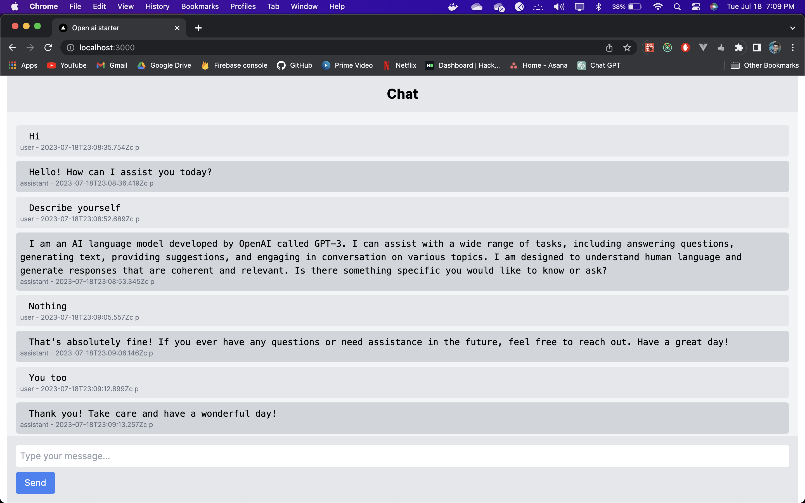

This is an openai-starter application which user `gpt-3.5-turbo` model to generate text. The model is trained on the [OpenAI GPT-3 Playground](https://beta.openai.com/playground) with the following prompt:

# Prerequisites

- Node.js 18.0.0
- API key from [OpenAI](https://beta.openai.com/) (set as `OPENAI_API_KEY` environment variable in `.env.local`)

# Getting started

`npm install` to install dependencies

`npm run dev` to start the development server

`npm run build` to build for production

`npm run start` to start the production server

# Screenshots

